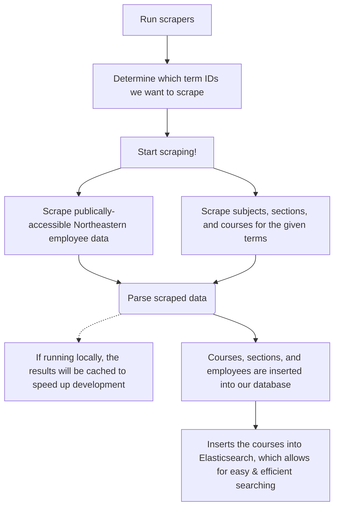
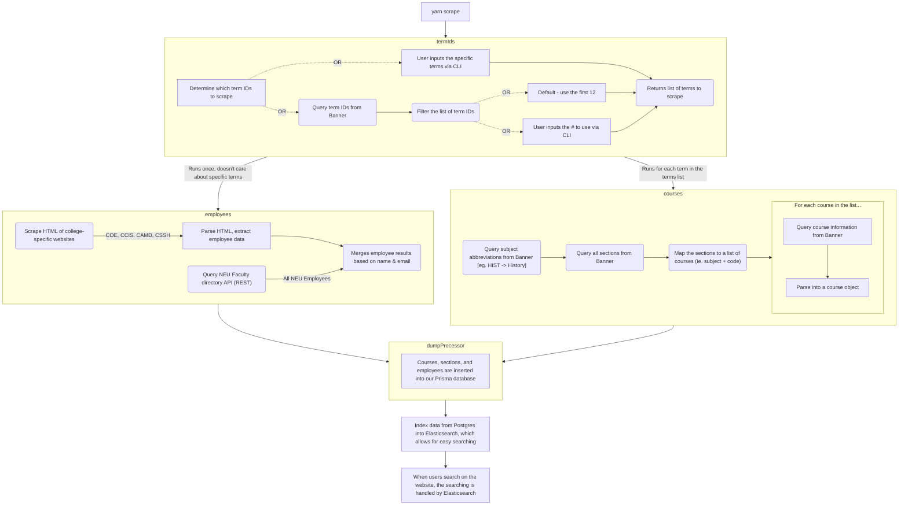

# The Course Catalog API

## Installation

Read `documentation/onboarding_setup`

## Scraping

### Intro

This is the core of SearchNEU, and this `course-catalog-api`. This is how we fetch, process, and store all of the data.

### Overview

(Copy the following code block to a [Mermaid playground](https://mermaid.live/edit#eyJjb2RlIjoiZ3JhcGggVERcbiAgICBBW0NocmlzdG1hc10gLS0-fEdldCBtb25leXwgQihHbyBzaG9wcGluZylcbiAgICBCIC0tPiBDe0xldCBtZSB0aGlua31cbiAgICBDIC0tPnxPbmV8IERbTGFwdG9wXVxuICAgIEMgLS0-fFR3b3wgRVtpUGhvbmVdXG4gICAgQyAtLT58VGhyZWV8IEZbZmE6ZmEtY2FyIENhcl1cbiAgIiwibWVybWFpZCI6IntcbiAgXCJ0aGVtZVwiOiBcImRhcmtcIlxufSIsInVwZGF0ZUVkaXRvciI6ZmFsc2UsImF1dG9TeW5jIjp0cnVlLCJ1cGRhdGVEaWFncmFtIjpmYWxzZX0) if you can't view the diagram)

High-level:


More in-depth


### Custom Scraping

Scraping course data for multiple terms can take quite a bit of time. Caching scrapes is fantastic for quickly initializing local databases, but for scraper-related work we might need to run real scrapes often. 

In order to speed up scraper-related dev work we can specify custom scraping filters so that we only fetch data for a subset of the total courses for the given terms. Filters are specified in `scrapers/filters.ts` in the following format:

```ts
const filters = {
  campus: (campus: string) => boolean,
  subject: (subject: string) => boolean,
  courseNumber: (courseNumber: number) => boolean,
  truncate: boolean,
};
```

For example:
```js
const filters = {
  campus: (campus) => true,
  subject: (subject) => ["CS", "MATH"].includes(subject),
  courseNumber: (courseNumber) => courseNumber >= 3000,
  truncate: true,
};
```

The custom scrape will only scrape courses that fulfill **all** filters, so the above can be read as: "Scrape all courses from all campuses that have subject "CS" or "MATH" AND have a course number 3000 or higher. Clear out my local database before inserting the custom scrape data."

The custom scrape will _not_ overwrite the cache, and therefore it will also never read from the cache.

#### Flags

- `truncate`
  - If `truncate` is set to true, then the `courses` and `sections` tables in your local database will be cleared before they are re-populated with the scraped data. The `classes` elasticsearch index will also be cleared before being re-populated with scraped data.

#### Related Courses

There are a number of course-to-course relations that we store - coreqs of a course, prereqs of a course, courses that the given course is a prereq of, and courses that the given course is an optional prereq of. It's important to note how the custom scrape will behave in these cases, for example if `Course A` is a prereq of `Course B`, and the filters include `Course B` but _not_ `Course A`.

Assuming the filters include `B` but _not_ `A`:

- If `B` has `A` as a `prereq` or `coreq`, then in your local database `B` will know that `A` exists as a `prereq` or `coreq`, but `A` will not have been scraped so `A` will be marked as `missing` in the `prereq` or `coreq` field.
- If `A` has `B` as a `prereq` or `optionalPrereq`, then `B` will not know anything about `A`, meaning `B`'s `prereqs_for` or `opt_prereqs_for` fields will _not_ include `A`.

In summary, if you're looking at any course-to-course info while using a custom scrape then pay extra attention to what exactly you scraped. When in doubt, do a full scrape.

The command to run the custom scrape is:

`yarn scrape:custom`
