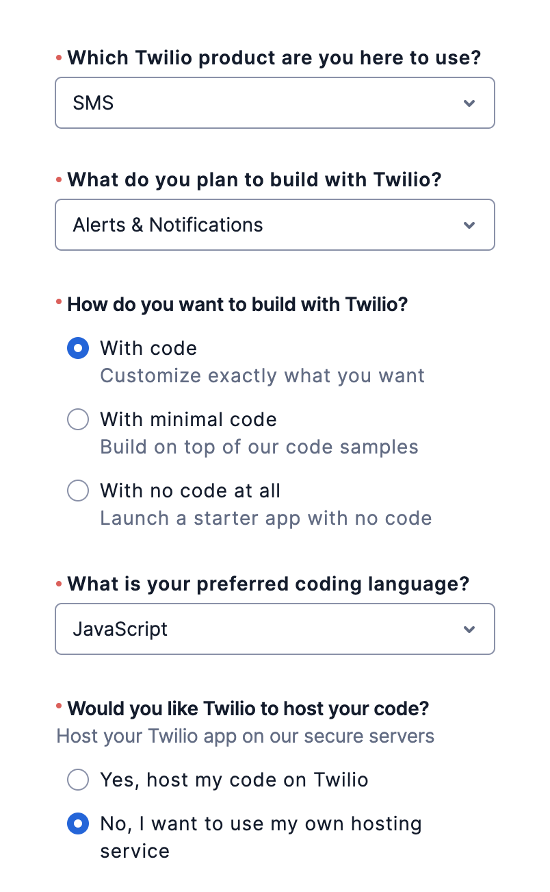
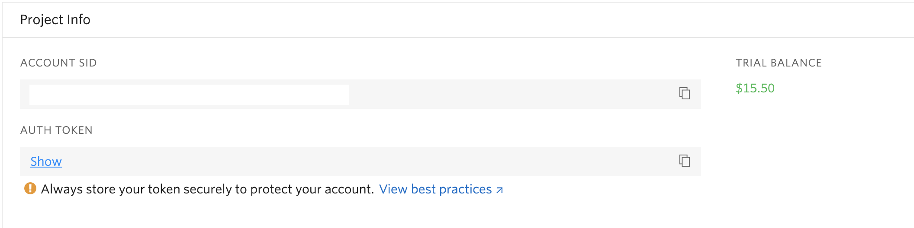
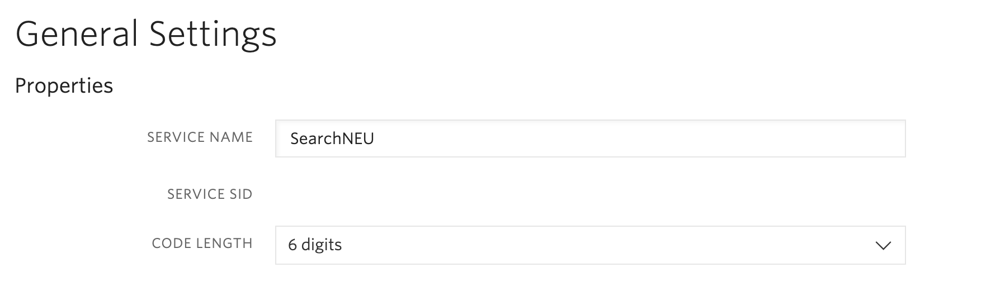

# Notifications

## Setting Up The Dev Environment (Backend)

All the environment variables you need to set up notifications are in `template.env`.

- Make a copy of this file and name it `.env`

  - The `JWT_SECRET` can be any random string
  - `CLIENT_ORIGIN` should already be filled out (`http://localhost:5000`)

Follow these steps to get the Twilio environment variables:

1. Create a free account with Twilio.
   - You can fill out your profile like this: 
2. Once you're set up, the landing page contains the info for `TWILIO_ACCOUNT_SID` and `TWILIO_AUTH_TOKEN`.
   - Note: you don't need quotes in your `.env` file; you can just have something like `TWILIO_ACCOUNT_SID=abc123`.
     
3. Click on the button to get a Twilio phone number.
   - Store the value in `.env` like `TWILIO_PHONE_NUMBER=+12342342345`.
4. You need to create a Twilio Verify service to handle sending out and confirming verification codes.
   - Click on `Explore Products` on the left nav bar of the Twilio landing page
   - Find `Account Security` and click on the `Verify` product
   - Click on `Create Service Now` - you can give the service the name `SearchNEU`
   - The service SID is the value for `TWILIO_VERIFY_SERVICE_ID` 

Once your `.env` file is filled out, you can start up the notification server by running `yarn dev:notifs`

---

## How It Works
